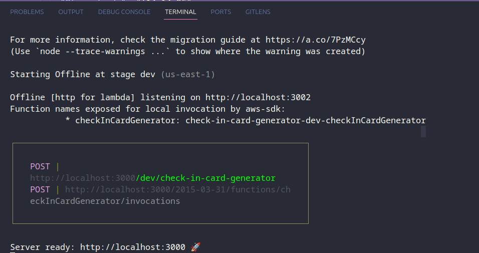
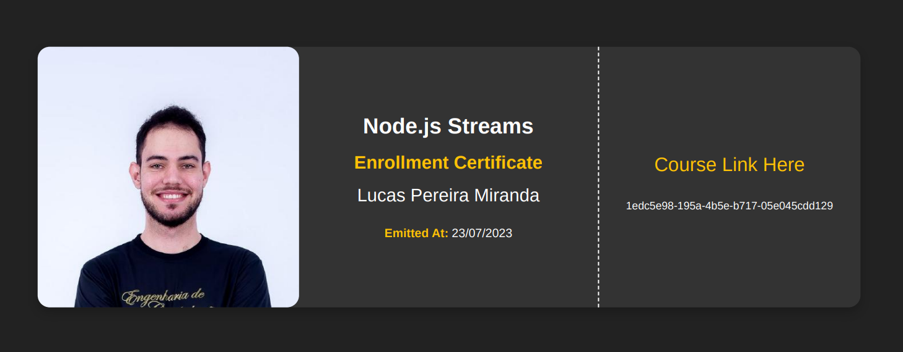

<h1 align="center">
  <br/>

Check-In Card Generator

</h1>

<p align="center">
  

  
  
  <a href="https://github.com/LucasPereiraMiranda/check-in-card-generator/commits/master">
    
  </a>

  <a href="https://github.com/LucasPereiraMiranda/check-in-card-generator/issues">
    
  </a>

  <a href="https://github.com/LucasPereiraMiranda/check-in-card-generator/issues">
    
  </a>
</p>

<br>

## 🚀 Techs

Check-in card generator lambda function was developed with these technologies

- [Serverless Framework](https://www.serverless.com/)
- [Typescript](https://www.typescriptlang.org/)
- [Aws Lambda](https://aws.amazon.com/pt/lambda/)
- [Aws Dynamodb](https://aws.amazon.com/pt/dynamodb/)
- [Handlebars](https://handlebarsjs.com/)
- [HTML](https://developer.mozilla.org/en-US/docs/Web/HTML)
- [CSS](https://developer.mozilla.org/en-US/docs/Web/CSS)
- [Yup](https://www.npmjs.com/package/yup)

## 💻 Project

This project's Lambda function has been developed with the primary objective of studying and exploring the core principles of the FAAS (Functions as a Service) concept, the serverless framework in general, and the AWS stack with Lambda and DynamoDB.

This version provides a tool for generating check-in cards for online classrooms, welcoming new students to the class and offering a customized way to access the course.

## :boom: Installation

```bash
# With NVM in our environment, we can use the Node version indicated in the .nvmrc file:
$ nvm use

# We can install the dependencies with:
$ yarn install

# To run the following processes, we need to have Serverless installed globally in the environment. To do this, we can execute:
$ yarn add serverless - G

# We can install the local DynamoDB with:
$ yarn dynamodb:install

# Note: To run the local DynamoDB simulator, we need to have Java installed in the environment.

# In a new terminal, we can start DynamoDB with:
$ yarn dynamodb:start

# To initialize the Lambda function in the local environment, we can execute:
$ yarn start:dev
```

### 💻 Execution

<h1 align="center">
    
</h1>

### :boom: Generated check-in card

<h1 align="center">
    
</h1>

## License

[MIT](https://choosealicense.com/licenses/mit/)
